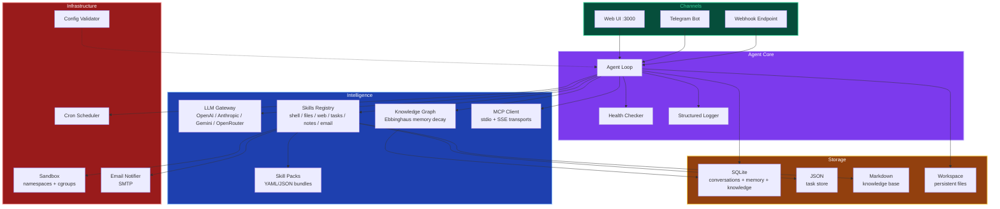

# PennyClaw

**Your $0/month personal AI agent, running 24/7 on GCP's free tier.**

[](https://shell.cloud.google.com/cloudshell/editor?cloudshell_git_repo=https://github.com/mandarl/pennyclaw.git&cloudshell_tutorial=docs/deploy-tutorial.md&cloudshell_workspace=.)
[](https://github.com/mandarl/pennyclaw/actions/workflows/ci.yml)
[](LICENSE)
[](https://go.dev)

---

PennyClaw is a lightweight, open-source AI agent built from scratch in Go, designed to run comfortably within the constraints of Google Cloud Platform's **Always Free** `e2-micro` VM (1GB RAM, 2 shared vCPUs, 30GB disk). One click deploys it. Zero dollars keeps it running.

## Why PennyClaw?

Most self-hosted AI agents assume you have a beefy VPS. PennyClaw is purpose-built for the smallest free VM you can get:

| | Typical self-hosted agent | PennyClaw |
|---|---|---|
| **RAM Usage** | 500 MB - 4 GB | **< 50 MB idle** |
| **Monthly Cost** | $5-20/mo VPS | **$0/mo** (GCP free tier) |
| **Deployment** | Docker + config | **One click** |
| **Binary** | Python/TypeScript + deps | **Single Go binary (~16 MB)** |
| **External deps** | Redis, Postgres, etc. | **Zero** (SQLite embedded) |

> *"I was tired of paying for servers I barely use. GCP gives everyone a free VM — so I built an agent that fits inside it."*

## Demo

<p align="center">
  
</p>

## Quick Start

### Option 1: One-Click Deploy to GCP (Recommended)

Click the button below to deploy PennyClaw to your own GCP free-tier VM in under 5 minutes:

[](https://shell.cloud.google.com/cloudshell/editor?cloudshell_git_repo=https://github.com/mandarl/pennyclaw.git&cloudshell_tutorial=docs/deploy-tutorial.md&cloudshell_workspace=.)

The deployment script includes **24 pre-flight checks** to ensure you stay within the free tier:

- Detects existing e2-micro instances (only 1 is free)
- Validates region eligibility (us-west1, us-central1, us-east1)
- Guards against premium network tier charges
- Verifies disk type and size limits
- Shows a $0.00 cost breakdown before deploying
- Auto-configures swap for ~1.5GB effective RAM
- Generates a one-command teardown script

### Option 2: Run Locally

```bash
git clone https://github.com/mandarl/pennyclaw.git
cd pennyclaw
cp config.example.json config.json

# Set your API key
export OPENAI_API_KEY="sk-your-key-here"

# Build and run
make run
```

Open http://localhost:3000 in your browser.

### Option 3: Docker

```bash
git clone https://github.com/mandarl/pennyclaw.git
cd pennyclaw
docker build -t pennyclaw .
docker run -p 3000:3000 \
  -e OPENAI_API_KEY="sk-your-key-here" \
  pennyclaw
```

## Features

### Agent Core

PennyClaw implements a complete agent loop: receive user message, build context from conversation history, call the LLM, execute tool calls, and repeat until a text response is produced. The agent supports up to 10 tool-calling iterations per request.

- **Multi-provider LLM gateway** — OpenAI, Anthropic, Google Gemini, OpenRouter, and any OpenAI-compatible API
- **Persistent memory** — SQLite-backed conversation history that survives restarts
- **Session management** — Create, switch, and delete conversations with sidebar navigation
- **Token tracking** — Monitor cumulative token usage across sessions

### Built-in Skills

PennyClaw ships with a comprehensive set of tools the agent can invoke:

| Category | Skill | Description |
|---|---|---|
| **System** | `run_command` | Execute sandboxed shell commands |
| **Files** | `read_file` | Read file contents from the workspace |
| **Files** | `write_file` | Create or overwrite files |
| **Web** | `web_search` | Search the web via DuckDuckGo |
| **Web** | `http_request` | Make HTTP requests to APIs (with SSRF protection) |
| **Tasks** | `task_add` | Create tasks with priority, due date, and tags |
| **Tasks** | `task_list` | List and filter tasks by status, priority, or tag |
| **Tasks** | `task_update` | Update task status, priority, title, or notes |
| **Tasks** | `task_delete` | Remove tasks by ID |
| **Notes** | `note_save` | Save markdown notes to a persistent knowledge base |
| **Notes** | `note_read` | Read a specific note |
| **Notes** | `note_list` | List all notes with metadata |
| **Notes** | `note_delete` | Remove notes |
| **Notes** | `note_search` | Full-text search with snippet extraction |
| **Email** | `send_email` | Send email notifications via SMTP |
| **Knowledge** | `knowledge_add` | Add entities (people, places, concepts) to the knowledge graph |
| **Knowledge** | `knowledge_relate` | Create relationships between entities |
| **Knowledge** | `knowledge_query` | Search the knowledge graph by name |
| **Knowledge** | `knowledge_relations` | Get all relationships for an entity |
| **Knowledge** | `knowledge_delete` | Remove an entity and its relations |
| **Knowledge** | `knowledge_stats` | Get knowledge graph statistics |
| **MCP** | `mcp_connect` | Connect to an MCP server (stdio or SSE transport) |
| **MCP** | `mcp_disconnect` | Disconnect from an MCP server |
| **MCP** | `mcp_list` | List connected MCP servers and their tools |
| **MCP** | `mcp_call` | Call a tool on a connected MCP server |

Skills can also be loaded from external YAML/JSON bundles via the skill pack system, allowing you to extend PennyClaw without modifying Go code.

### Communication Channels

PennyClaw supports multiple ways to interact with the agent:

| Channel | Description |
|---|---|
| **Web UI** | Full-featured embedded chat with Markdown rendering, syntax highlighting, dark/light themes, file upload, keyboard shortcuts, and mobile support |
| **Telegram Bot** | Long-polling bot with chat ID allowlist, Markdown formatting, and automatic message chunking for long responses |
| **Webhook Endpoint** | HTTP endpoint for external services (GitHub, IFTTT, Zapier) with HMAC-SHA256 signature verification, sync and async modes |
| **Discord Bot** | Planned (channel config exists, bot implementation coming) |

### Web UI Features

The embedded web interface includes:

- In-browser logs viewer with color-coded log levels and auto-refresh
- Settings panel to change model, API key, temperature, and system prompt (no SSH required)
- Self-update mechanism to check for and install updates from the UI
- One-click copy on all code blocks
- Export conversations as Markdown files
- Drag-and-drop file upload
- Notification sound when responses arrive
- Keyboard shortcuts: Ctrl+K (new chat), Ctrl+L (clear), Ctrl+E (export), Esc (close panels)

### Knowledge Graph with Memory Decay

PennyClaw maintains a knowledge graph that learns about your world over time. Entities (people, places, concepts, preferences, projects) are stored with weighted relationships and subject to **Ebbinghaus memory decay** — memories that are never reinforced gradually fade, keeping the graph lean and relevant.

- **Automatic context injection** — The strongest memories are included in every system prompt, giving the agent persistent awareness
- **Ebbinghaus forgetting curve** — Strength decays exponentially over time: `S(t) = S₀ × e^(-λt)`
- **Spacing effect** — Frequently accessed memories decay slower (adjusted by access count)
- **Automatic pruning** — Entities below the strength threshold are removed to save memory
- **Web UI panel** — Browse, search, and manage entities and relationships visually

### Native MCP Client

PennyClaw includes a built-in [Model Context Protocol](https://modelcontextprotocol.io/) (MCP) client, allowing it to connect to any MCP-compatible server and use its tools. This gives PennyClaw instant access to hundreds of community-built integrations.

- **Stdio transport** — Launch MCP servers as subprocesses (e.g., `npx @modelcontextprotocol/server-filesystem`)
- **SSE transport** — Connect to remote MCP servers via HTTP Server-Sent Events
- **Auto-reconnect** — Server configurations are persisted and reconnected on restart
- **Web UI panel** — Add, manage, and monitor MCP server connections visually
- **Zero dependencies** — Pure Go JSON-RPC 2.0 implementation

### Automation

- **Cron scheduler** — Schedule recurring tasks with cron expressions (e.g., daily summaries, periodic checks)
- **Workspace** — Persistent file workspace with bootstrap scripts that run on first message

### Observability

PennyClaw exposes detailed health and performance metrics:

- **`GET /api/health`** — JSON report with system metrics (memory, CPU, goroutines, disk, GC stats), agent metrics (request count, latency P99, error rate, active requests), and individual health checks with status thresholds
- **`GET /api/metrics`** — Prometheus-compatible text exposition format for scraping
- **Structured logging** — JSON lines output with log levels (DEBUG/INFO/WARN/ERROR), component prefixes, caller info for errors, and key-value fields

### Security

- **Secure-by-default auth** — Auto-generates an auth token on startup if none is set
- **Login screen** — Web UI prompts for token, stores in localStorage, sends as Bearer token
- **Rate limiting** — 20 requests per minute per IP on the chat endpoint
- **Native Linux sandboxing** — Namespaces and cgroups, no Docker daemon overhead
- **Non-root execution** — Runs as dedicated `pennyclaw` user
- **systemd hardening** — `ProtectSystem=strict`, `NoNewPrivileges`, `PrivateTmp`
- **Memory limits** — Cgroup-enforced 800MB ceiling prevents OOM kills
- **Path traversal protection** — File skills restricted to sandbox directory; note names sanitized
- **SSRF protection** — HTTP request skill blocks internal IPs, loopback, and cloud metadata endpoints
- **Webhook signature verification** — HMAC-SHA256 (GitHub `X-Hub-Signature-256` compatible)
- **Telegram chat allowlist** — Restrict bot access to specific chat IDs
- **Config validation** — Startup checks catch common mistakes (missing keys, invalid ports, unresolved env vars) with actionable error messages

### Deployment

- **One-click GCP deploy** — Guided Cloud Shell tutorial with automated setup
- **24 pre-flight checks** — Validates free tier eligibility before spending a cent
- **Auto-swap config** — 512MB swap file extends effective RAM to ~1.5GB
- **systemd service** — Auto-restarts on crash, starts on boot
- **Unattended upgrades** — Automatic security patches
- **Docker support** — Multi-stage Dockerfile for containerized deployment

## Architecture



### Package Structure

```
cmd/pennyclaw/          Main entry point, CLI flags, signal handling
internal/
  agent/                Agent loop: context building, LLM calls, tool execution
  channels/
    web/                HTTP server, web UI (embedded HTML), REST API
    telegram/           Telegram bot (long polling, no external deps)
    webhook/            Webhook endpoint with HMAC-SHA256 verification
  config/               Config loading, env var resolution, validation
  cron/                 Cron scheduler for recurring tasks
  health/               Health checks, system metrics, Prometheus endpoint
  knowledge/            Knowledge graph with Ebbinghaus memory decay (SQLite)
  llm/                  Multi-provider LLM gateway (OpenAI, Anthropic, Gemini)
  logging/              Structured leveled logger (JSON or human-readable)
  mcp/                  Model Context Protocol client (stdio + SSE transports)
  memory/               SQLite-backed conversation store
  notify/               Email notifications via SMTP
  sandbox/              Linux namespace/cgroup sandboxing for tool execution
  skillpack/            External skill loader (YAML/JSON bundles)
  skills/               Skill registry, built-in skills, productivity tools
  workspace/            Persistent file workspace with bootstrap support
scripts/                Deployment and teardown scripts
docs/                   Deploy tutorial, assets
```

### Data Flow

1. A message arrives via one of the channels (web UI, Telegram, or webhook).
2. The agent saves the message to SQLite and builds a context window from conversation history.
3. The system prompt is assembled from the base prompt, workspace context, knowledge graph memories, and MCP tool listings.
4. The LLM is called with the message history and available tools (including MCP tools from connected servers).
5. If the LLM returns tool calls, the agent executes each skill and feeds results back.
6. Steps 4-5 repeat (up to 10 iterations) until the LLM returns a text response.
7. The response is saved to memory and returned to the channel.

Throughout this process, the health checker tracks request latency, error rates, and tool call counts. The structured logger records events at the configured level.

## GCP Free Tier Specs

PennyClaw is architected for these exact constraints:

| Resource | Free Tier | PennyClaw Usage |
|---|---|---|
| VM | 1x e2-micro/month | 1x e2-micro |
| vCPU | 2 shared cores | ~5% idle |
| RAM | 1 GB | < 50 MB idle, < 200 MB active |
| Disk | 30 GB pd-standard | 30 GB |
| Egress | 1 GB/month (Americas) | ~50 MB/month typical |
| Regions | us-west1, us-central1, us-east1 | Auto-selected |

## Configuration

PennyClaw uses a single `config.json` file. Environment variables prefixed with `$` are automatically resolved at startup.

### Minimal Config

```json
{
  "llm": {
    "provider": "openai",
    "model": "gpt-4.1-mini",
    "api_key": "$OPENAI_API_KEY"
  }
}
```

Everything else uses sensible defaults (web UI on port 3000, SQLite in `data/`, sandbox enabled).

### Full Config Reference

```json
{
  "server": {
    "host": "0.0.0.0",
    "port": 3000
  },
  "llm": {
    "provider": "openai",
    "model": "gpt-4.1-mini",
    "api_key": "$OPENAI_API_KEY",
    "base_url": "",
    "max_tokens": 4096,
    "temperature": 0.7
  },
  "channels": {
    "web": {
      "enabled": true
    },
    "telegram": {
      "enabled": false,
      "token": "$TELEGRAM_BOT_TOKEN"
    },
    "discord": {
      "enabled": false,
      "token": "$DISCORD_BOT_TOKEN"
    },
    "webhook": {
      "enabled": false,
      "secret": "$WEBHOOK_SECRET"
    }
  },
  "memory": {
    "db_path": "data/pennyclaw.db",
    "max_history": 50,
    "persist_sessions": true
  },
  "sandbox": {
    "enabled": true,
    "work_dir": "/tmp/pennyclaw-sandbox",
    "max_timeout": 30,
    "max_memory": 128
  },
  "email": {
    "enabled": false,
    "smtp_host": "smtp.gmail.com",
    "smtp_port": 587,
    "username": "you@gmail.com",
    "password": "$GMAIL_APP_PASSWORD",
    "from_address": "you@gmail.com",
    "from_name": "PennyClaw"
  },
  "system_prompt": "You are PennyClaw, a helpful personal AI assistant."
}
```

### Config Field Reference

| Section | Field | Type | Default | Description |
|---|---|---|---|---|
| `server` | `host` | string | `"0.0.0.0"` | Bind address |
| `server` | `port` | int | `3000` | HTTP port (1-65535) |
| `llm` | `provider` | string | `"openai"` | `openai`, `anthropic`, `gemini`, or `openai-compatible` |
| `llm` | `model` | string | `"gpt-4.1-mini"` | Model identifier |
| `llm` | `api_key` | string | `"$OPENAI_API_KEY"` | API key or `$ENV_VAR` reference |
| `llm` | `base_url` | string | `""` | Custom endpoint for OpenAI-compatible APIs |
| `llm` | `max_tokens` | int | `4096` | Max tokens per response (1-128000) |
| `llm` | `temperature` | float | `0.7` | Sampling temperature (0-2) |
| `channels.web` | `enabled` | bool | `true` | Enable the web UI |
| `channels.telegram` | `enabled` | bool | `false` | Enable Telegram bot |
| `channels.telegram` | `token` | string | `""` | Bot token from @BotFather |
| `channels.discord` | `enabled` | bool | `false` | Enable Discord bot |
| `channels.discord` | `token` | string | `""` | Discord bot token |
| `channels.webhook` | `enabled` | bool | `false` | Enable webhook endpoint at `/api/webhooks` |
| `channels.webhook` | `secret` | string | `""` | HMAC-SHA256 secret for signature verification |
| `memory` | `db_path` | string | `"data/pennyclaw.db"` | SQLite database path |
| `memory` | `max_history` | int | `50` | Messages to include in LLM context (1-500) |
| `memory` | `persist_sessions` | bool | `true` | Persist sessions across restarts |
| `sandbox` | `enabled` | bool | `true` | Enable sandboxed command execution |
| `sandbox` | `work_dir` | string | `"/tmp/pennyclaw-sandbox"` | Sandbox working directory |
| `sandbox` | `max_timeout` | int | `30` | Max command execution time (seconds) |
| `sandbox` | `max_memory` | int | `128` | Max memory for sandboxed processes (MB) |
| `email` | `enabled` | bool | `false` | Enable email notifications |
| `email` | `smtp_host` | string | `""` | SMTP server hostname |
| `email` | `smtp_port` | int | `587` | SMTP port (1-65535) |
| `email` | `username` | string | `""` | SMTP username |
| `email` | `password` | string | `""` | SMTP password or `$ENV_VAR` reference |
| `email` | `from_address` | string | `""` | Sender email (defaults to username) |
| `email` | `from_name` | string | `"PennyClaw"` | Sender display name |
| | `system_prompt` | string | *(built-in)* | Custom system prompt for the agent |

### OpenRouter / Custom Providers

PennyClaw works with any OpenAI-compatible API. To use OpenRouter:

```json
{
  "llm": {
    "provider": "openai",
    "model": "anthropic/claude-sonnet-4-20250514",
    "api_key": "$OPENROUTER_API_KEY",
    "base_url": "https://openrouter.ai/api/v1"
  }
}
```

You can also use `"provider": "openai-compatible"` for any endpoint that follows the OpenAI chat completions format.

### Config Validation

PennyClaw validates the configuration at startup and provides actionable error messages:

```
config validation failed:
  - llm.api_key references env var $OPENAI_API_KEY which is not set; export it before starting PennyClaw
  - channels.telegram.token is required when Telegram is enabled
  - email.smtp_port must be between 1 and 65535, got 0
```

## API Endpoints

| Method | Path | Description |
|---|---|---|
| `GET` | `/` | Web UI |
| `POST` | `/api/chat` | Send a message (rate limited: 20/min/IP) |
| `GET` | `/api/sessions` | List all sessions |
| `POST` | `/api/sessions` | Create a new session |
| `DELETE` | `/api/sessions/:id` | Delete a session |
| `GET` | `/api/history/:id` | Get conversation history |
| `GET` | `/api/health` | Health check with system and agent metrics |
| `GET` | `/api/metrics` | Prometheus-compatible metrics |
| `GET` | `/api/logs` | Recent log entries |
| `GET` | `/api/config` | Current configuration (sensitive fields redacted) |
| `PUT` | `/api/config` | Update configuration |
| `POST` | `/api/webhooks` | Webhook endpoint (when enabled) |
| `POST` | `/api/upload` | File upload |
| `GET` | `/api/knowledge` | List knowledge graph entities |
| `GET` | `/api/knowledge/search?q=` | Search entities by name |
| `GET` | `/api/knowledge/stats` | Knowledge graph statistics |
| `GET` | `/api/knowledge/:id/relations` | Get entity relationships |
| `DELETE` | `/api/knowledge/:id` | Delete an entity |
| `GET` | `/api/mcp` | List MCP connections and tools |
| `POST` | `/api/mcp/connect` | Connect to an MCP server |
| `POST` | `/api/mcp/disconnect` | Disconnect from an MCP server |
| `GET` | `/api/mcp/tools` | List all available MCP tools |

## Security

PennyClaw includes multiple layers of security, but **it is not a hardened production system**. Use it for personal automation, not for handling sensitive data.

```bash
# Set a custom auth token
export PENNYCLAW_AUTH_TOKEN=$(openssl rand -hex 32)

# Or let PennyClaw generate one automatically (check the startup log)
./pennyclaw --config config.json
```

> **Known limitations:** The `run_command` skill executes arbitrary shell commands within the sandbox. While sandboxed, this is inherently powerful. The sandbox provides defense-in-depth but is not a security boundary against a determined attacker. Do not expose PennyClaw to untrusted users.

### Accessing the Web UI Securely

PennyClaw listens on `localhost:3000` by default. Since GCP e2-micro VMs don't have public HTTPS, here are the recommended access methods:

**Method 1: SSH Tunnel (Recommended)**

```bash
gcloud compute ssh pennyclaw-vm \
  --zone=us-central1-a \
  --ssh-flag="-L 3000:localhost:3000"
# Then open http://localhost:3000
```

**Method 2: Caddy Reverse Proxy (HTTPS)**

```bash
sudo apt install -y caddy
echo 'your-domain.com { reverse_proxy localhost:3000 }' | sudo tee /etc/caddy/Caddyfile
sudo systemctl restart caddy
```

**Method 3: Cloudflare Tunnel (No Open Ports)**

```bash
cloudflared tunnel --url http://localhost:3000
```

## Pre-Flight Checks

Run `make preflight` to validate your GCP setup without deploying:

```
PHASE 1: GCP Account & Authentication
  gcloud CLI installed (462.0.1)
  Authenticated as: user@gmail.com

PHASE 2: Free Tier Eligibility
  No existing e2-micro instances

PHASE 3: Region Selection
  Selected: us-central1 (42ms latency)

PHASE 4: Cost Protection
  Machine type: e2-micro
  Disk: 30GB pd-standard
  Network: STANDARD tier

PHASE 5: Cost Summary
  TOTAL: $0.00/month
```

## Build Targets

| Target | Command | Description |
|---|---|---|
| Build | `make build` | Compile the binary to `bin/pennyclaw` |
| Run | `make run` | Build and run locally |
| Test | `make test` | Run all tests with race detector |
| Docker | `make docker` | Build Docker image |
| Deploy | `make deploy` | Deploy to GCP free tier (interactive) |
| Teardown | `make teardown` | Remove PennyClaw from GCP |
| Preflight | `make preflight` | Run pre-flight checks only |
| Logs | `make logs` | View service logs (on GCP VM) |
| Help | `make help` | Show all available targets |

## Teardown

Remove everything with one command:

```bash
make teardown
```

This deletes the VM and firewall rules. No further charges.

## Limitations

PennyClaw is a weekend project that solves a specific problem (free self-hosted AI agent). It is **not** a replacement for production agent frameworks:

- **Not a true agent:** PennyClaw uses a simple tool-calling loop, not multi-step planning, reflection, or chain-of-thought reasoning. It's closer to a "chatbot with tools" than an autonomous agent.
- **Single-user:** Designed for personal use. No multi-tenant support, no user management.
- **GCP free tier constraints:** The e2-micro VM is slow. Expect 2-5 second response times. CPU-intensive tasks may hit the shared vCPU limit.
- **No streaming:** Responses are returned all at once, not streamed token-by-token.
- **Basic sandboxing:** The sandbox provides isolation but is not a security boundary. Do not expose to untrusted users.
- **GCP free tier may change:** Google could modify or discontinue the Always Free tier at any time.

## Contributing

See [CONTRIBUTING.md](CONTRIBUTING.md) for development setup, code style, and contribution guidelines.

## License

MIT License. See [LICENSE](LICENSE) for details.

---

**PennyClaw** — Because your AI agent shouldn't cost more than a penny.
