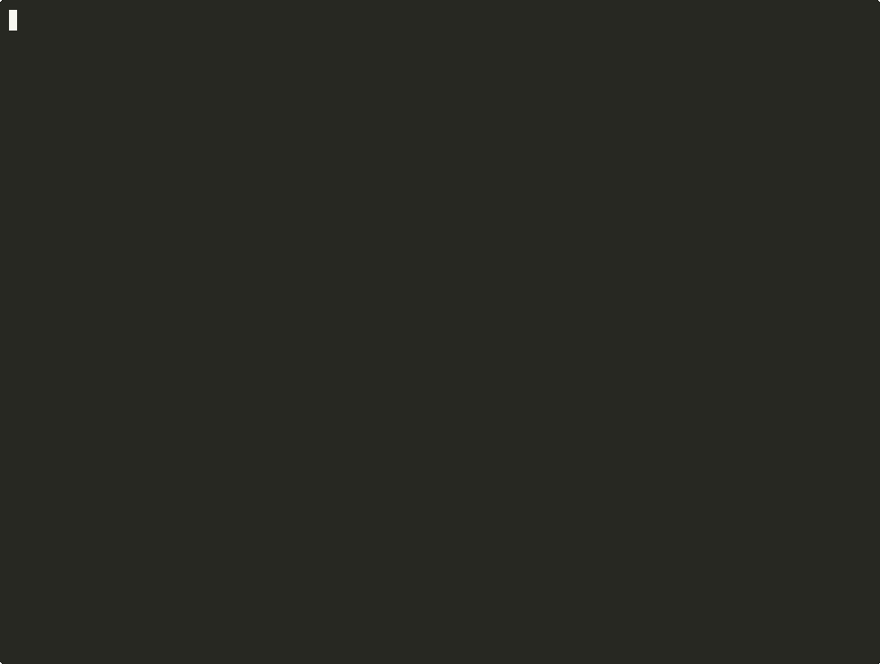
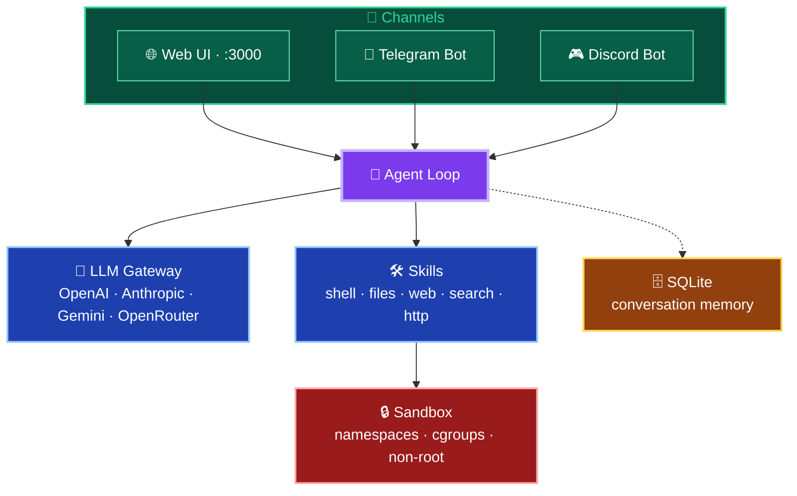

# 🪙 PennyClaw

**Your $0/month personal AI agent, running 24/7 on GCP's free tier.**

[](https://shell.cloud.google.com/cloudshell/editor?cloudshell_git_repo=https://github.com/mandarl/pennyclaw.git&cloudshell_tutorial=docs/deploy-tutorial.md&cloudshell_workspace=.)
[](https://github.com/mandarl/pennyclaw/actions/workflows/ci.yml)
[](LICENSE)
[](https://go.dev)

---

PennyClaw is a lightweight, open-source AI agent built from scratch in Go, designed to run comfortably within the constraints of Google Cloud Platform's **Always Free** `e2-micro` VM (1GB RAM, 2 shared vCPUs, 30GB disk). One click deploys it. Zero dollars keeps it running — as long as GCP's free tier exists.

## Why PennyClaw?

Most self-hosted AI agents assume you have a beefy VPS. PennyClaw is purpose-built for the smallest free VM you can get:

| | Typical self-hosted agent | PennyClaw |
|---|---|---|
| **RAM Usage** | 500 MB - 4 GB | **< 50 MB idle** |
| **Monthly Cost** | $5-20/mo VPS | **$0/mo** (GCP free tier) |
| **Deployment** | Docker + config | **One click** |
| **Language** | Python/TypeScript | **Go** (single binary) |

> *"I was tired of paying for servers I barely use. GCP gives everyone a free VM — so I built an agent that fits inside it."*

## Demo

<p align="center">
  
</p>

## Quick Start

### Option 1: One-Click Deploy to GCP (Recommended)

Click the button below to deploy PennyClaw to your own GCP free-tier VM in under 5 minutes:

[](https://shell.cloud.google.com/cloudshell/editor?cloudshell_git_repo=https://github.com/mandarl/pennyclaw.git&cloudshell_tutorial=docs/deploy-tutorial.md&cloudshell_workspace=.)

The deployment script includes **24 pre-flight checks** to ensure you stay within the free tier:

- ✅ Detects existing e2-micro instances (only 1 is free)
- ✅ Validates region eligibility (us-west1, us-central1, us-east1)
- ✅ Guards against premium network tier charges
- ✅ Verifies disk type and size limits
- ✅ Shows a $0.00 cost breakdown before deploying
- ✅ Auto-configures swap for ~1.5GB effective RAM
- ✅ Generates a one-command teardown script

### Option 2: Run Locally

```bash
git clone https://github.com/mandarl/pennyclaw.git
cd pennyclaw
cp config.example.json config.json

# Set your API key
export OPENAI_API_KEY="sk-your-key-here"

# Build and run
make run
```

Open http://localhost:3000 in your browser.

### Option 3: Docker

```bash
git clone https://github.com/mandarl/pennyclaw.git
cd pennyclaw
docker build -t pennyclaw .
docker run -p 3000:3000 \
  -e OPENAI_API_KEY="sk-your-key-here" \
  pennyclaw
```

## Features

### Core
- **Multi-provider LLM gateway** — OpenAI, Anthropic, Google Gemini, OpenRouter, and any OpenAI-compatible API
- **Persistent memory** — SQLite-backed conversation history that survives restarts
- **Tool execution** — Sandboxed shell commands, file I/O, web search, HTTP requests
- **Web chat UI** — Clean, embedded interface with zero external dependencies
- **In-browser logs viewer** — Slide-out panel with color-coded log levels, auto-refresh, no SSH needed

### Deployment
- **One-click GCP deploy** — Guided Cloud Shell tutorial with automated setup
- **24 pre-flight checks** — Validates free tier eligibility before spending a cent
- **Auto-swap config** — 512MB swap file extends effective RAM to ~1.5GB
- **systemd service** — Auto-restarts on crash, starts on boot
- **Unattended upgrades** — Automatic security patches

### Security
- **Native Linux sandboxing** — Namespaces and cgroups, no Docker daemon overhead
- **Non-root execution** — Runs as dedicated `pennyclaw` user
- **systemd hardening** — `ProtectSystem=strict`, `NoNewPrivileges`, `PrivateTmp`
- **Memory limits** — Cgroup-enforced 800MB ceiling prevents OOM kills

## Architecture



## GCP Free Tier Specs

PennyClaw is architected for these exact constraints:

| Resource | Free Tier | PennyClaw Usage |
|---|---|---|
| VM | 1x e2-micro/month | 1x e2-micro |
| vCPU | 2 shared cores | ~5% idle |
| RAM | 1 GB | < 50 MB idle, < 200 MB active |
| Disk | 30 GB pd-standard | 30 GB |
| Egress | 1 GB/month (Americas) | ~50 MB/month typical |
| Regions | us-west1, us-central1, us-east1 | Auto-selected |

## Configuration

PennyClaw uses a single `config.json` file:

```json
{
  "llm": {
    "provider": "openai",
    "model": "gpt-4.1-mini",
    "api_key": "$OPENAI_API_KEY"
  },
  "channels": {
    "web": { "enabled": true },
    "telegram": { "enabled": false, "token": "$TELEGRAM_BOT_TOKEN" }
  }
}
```

Environment variables prefixed with `$` are automatically resolved.

### OpenRouter / Custom Providers

PennyClaw works with any OpenAI-compatible API. To use OpenRouter:

```json
{
  "llm": {
    "provider": "openai",
    "model": "anthropic/claude-sonnet-4-20250514",
    "api_key": "$OPENROUTER_API_KEY",
    "base_url": "https://openrouter.ai/api/v1"
  }
}
```

## Security

PennyClaw includes multiple layers of security, but **it is not a hardened production system**. Use it for personal automation, not for handling sensitive data.

- **Secure-by-default auth:** If no `PENNYCLAW_AUTH_TOKEN` is set, PennyClaw auto-generates one on startup and prints it to the log. Use `--insecure` to explicitly opt out.
- **Login screen:** The web UI shows a login prompt, stores the token in localStorage, and sends it as a `Bearer` token with every request
- **Rate limiting:** 20 requests per minute per IP on the chat endpoint
- **Path traversal protection:** File read/write skills are restricted to the sandbox directory
- **SSRF protection:** HTTP request skill blocks internal IPs, loopback, and cloud metadata endpoints
- **Sandbox isolation:** Tool execution runs in a restricted environment with namespace isolation (when running as root)
- **systemd hardening:** `ProtectSystem=strict`, `NoNewPrivileges=true`, memory limits

```bash
# Set a custom auth token
export PENNYCLAW_AUTH_TOKEN=$(openssl rand -hex 32)

# Or let PennyClaw generate one automatically (check the startup log)
./pennyclaw --config config.json
```

> **Known limitations:** The `run_command` skill executes arbitrary shell commands within the sandbox. While sandboxed, this is inherently powerful. The sandbox provides defense-in-depth but is not a security boundary against a determined attacker. Do not expose PennyClaw to untrusted users.

### Accessing the Web UI Securely

PennyClaw listens on `localhost:3000` by default. Since GCP e2-micro VMs don't have public HTTPS, here are the recommended access methods:

#### Method 1: SSH Tunnel (Recommended — Zero Config)

The simplest and most secure approach. No firewall rules, no domain, no certificates:

```bash
# From your local machine:
gcloud compute ssh pennyclaw-vm \
  --zone=us-central1-a \
  --ssh-flag="-L 3000:localhost:3000"

# Then open http://localhost:3000 in your browser
```

This creates an encrypted tunnel from your machine to the VM. The web UI is never exposed to the internet.

#### Method 2: Caddy Reverse Proxy (HTTPS with Let's Encrypt)

If you have a domain and want public HTTPS access:

```bash
# Install Caddy on the VM
sudo apt install -y caddy

# Create Caddyfile
sudo tee /etc/caddy/Caddyfile << 'EOF'
your-domain.com {
    reverse_proxy localhost:3000
}
EOF

# Restart Caddy (auto-obtains Let's Encrypt certificate)
sudo systemctl restart caddy
```

Caddy automatically provisions and renews TLS certificates. You'll also need to open port 443:

```bash
gcloud compute firewall-rules create allow-https \
  --allow=tcp:443 --target-tags=pennyclaw
```

#### Method 3: Cloudflare Tunnel (No Open Ports)

For public access without opening any firewall ports:

```bash
# Install cloudflared
curl -L https://github.com/cloudflare/cloudflared/releases/latest/download/cloudflared-linux-amd64 -o cloudflared
sudo mv cloudflared /usr/local/bin/ && sudo chmod +x /usr/local/bin/cloudflared

# Quick tunnel (generates a random *.trycloudflare.com URL)
cloudflared tunnel --url http://localhost:3000
```

> **Note:** The SSH tunnel method uses zero additional resources and is ideal for the e2-micro's constrained environment.

## Built-in Skills

| Skill | Description |
|---|---|
| `run_command` | Execute sandboxed shell commands |
| `read_file` | Read file contents |
| `write_file` | Create or overwrite files |
| `web_search` | Search the web via DuckDuckGo |
| `http_request` | Make HTTP requests to APIs |

## Pre-Flight Checks

Run `make preflight` to validate your GCP setup without deploying:

```
━━━ PHASE 1: GCP Account & Authentication ━━━
  ✓  gcloud CLI installed (462.0.1)
  ✓  Authenticated as: user@gmail.com
  ✓  Project: my-project-123
  ✓  Billing is enabled

━━━ PHASE 2: Free Tier Eligibility ━━━
  ✓  No existing e2-micro instances — you're eligible!
  ✓  No existing disks — full 30GB available

━━━ PHASE 3: Region Selection ━━━
  ✓  Selected: us-central1 (42ms latency)

━━━ PHASE 4: Cost Protection ━━━
  ✓  Machine type: e2-micro
  ✓  Disk: 30GB pd-standard
  ✓  Network: STANDARD tier

━━━ PHASE 5: Cost Summary ━━━
  TOTAL: $0.00/month ✓
```

## Teardown

Remove everything with one command:

```bash
make teardown
```

This deletes the VM and firewall rules. No further charges.

## Limitations

PennyClaw is a weekend project that solves a specific problem (free self-hosted AI agent). It is **not** a replacement for production agent frameworks:

- **Not a true agent:** PennyClaw uses a simple tool-calling loop, not multi-step planning, reflection, or chain-of-thought reasoning. It's closer to a "chatbot with tools" than an autonomous agent.
- **Single-user:** Designed for personal use. No multi-tenant support, no user management.
- **GCP free tier constraints:** The e2-micro VM is slow. Expect 2-5 second response times. CPU-intensive tasks may hit the shared vCPU limit.
- **No streaming:** Responses are returned all at once, not streamed token-by-token.
- **Basic sandboxing:** The sandbox provides isolation but is not a security boundary. Do not expose to untrusted users.
- **GCP free tier may change:** Google could modify or discontinue the Always Free tier at any time. PennyClaw has no control over this.

## Contributing

PennyClaw is MIT licensed. Contributions welcome!

1. Fork the repo
2. Create a feature branch
3. Make your changes
4. Run `make test`
5. Submit a PR

## License

MIT License. See [LICENSE](LICENSE) for details.

---

**PennyClaw** — Because your AI agent shouldn't cost more than a penny.
